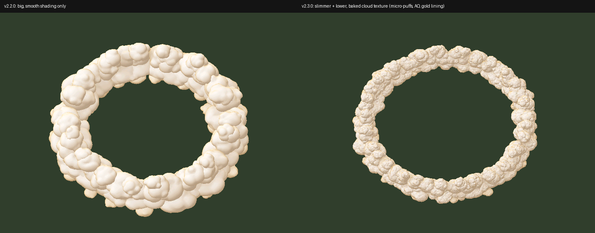
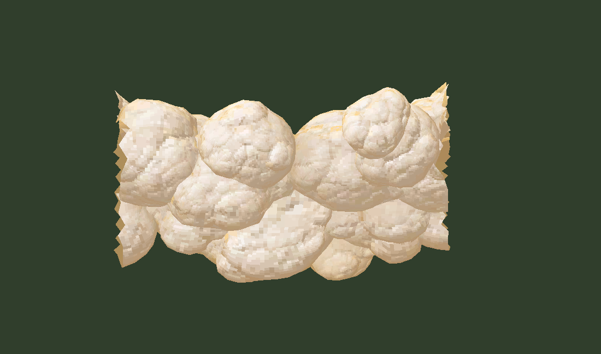
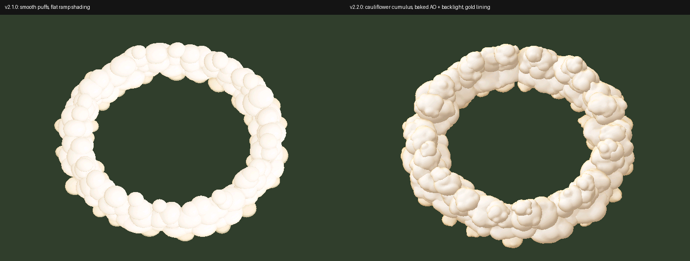

# Reaper Aurora – Angelic (v2.3.0)

Based on `Reaper-Angelic-v2_0_0.fantome` (white/gold VFX, ivory outfit, white wings).

## v2.3.0 – Slimmer, textured clouds

**Smaller** (`tools/gen_clouds3.py`): clouds are ~60% of their previous size, so the
ring is thinner (radius 465–704 vs 450–734) and lower (top ≈134 vs ≈230), on the same
585-unit centre line as the ult edge. Rise animation unchanged.

**Real texture**: the 256² light/gold ramp is replaced by a 2048² DXT1 atlas. Each
puff is cube-mapped into its own tiles (867 tiles, padded so there are no seams), and
every texel is baked from the 3D surface. Each texel gets a bump-mapped "micro-puff"
cauliflower surface, soft creases, fbm wisps, ray-traced AO from neighbouring puffs,
a backlit sun, a gold rim facing the camera and a gold glow at the base. About 50k
triangles, 36k vertices.

## v2.2.0 – Better clouds, no more red on the ult

**Clouds** (`tools/gen_clouds2.py`): rebuilt the ring with cauliflower-style cumulus
lobes, real ray-traced ambient occlusion between puffs, a sun placed behind the ring
(bright tops, shaded fronts) and a gold "silver lining" on the edges facing the
camera. Triangles buried inside other puffs are culled (~64k tris). The DXT5 ramp
texture is now `u = light`, `v = gold amount`.

**Red ult VFX** (`tools/recolor.py`): the enemy/"RED" versions of the ult ring and
recast effects (`Aurora_Base_R_AoERingStaticRED`, `..._R_AoERingRecastRED`,
`..._R_AoERingRecastEnemy`, plus `Q_Vulnerable_Enemy`) had never been recoloured and
showed red when the ult faded. Their 92 red colour values now use the same gold rule
as the friendly versions: brightness `m` → `(m, 0.82m, 0.45m)`. Texture channel
mixers (`erosionMapChannelMixer`, `palleteSrcMixColor`) are skipped on purpose.
`data/aurora_vfx_skin0.bin` is the only bin that changed.

## v2.1.0 – Ult (R) heavenly cloud ring

The R zone (`Aurora_Base_R_AoERingStatic` → `demonwall` emitter) used a ported Yorick
graveyard wall (`yeswall.skn`: tombstones, wooden fences, dead branches) with a
red/black Yorick ghoul texture, which clashed with the white/gold VFX everywhere else.

Changes (only these two WAD entries are different, same paths so no bin edits):

| Path | Change |
| --- | --- |
| `assets/f1117fc3/reaperaurora/yeswall.skn` | Replaced with a procedural ring of ~160 puffy cumulus clouds (same footprint/height, all weighted to `Root`, so the existing rise-out-of-ground `yeswall.anm` still plays) |
| `assets/f1117fc3/reaperaurora/yorickwghoul_skin50_tx_cm.skins_yorick_skin50.dds` | Replaced with a 256² DXT5 cloud shading ramp: ivory highlights (≈1.0, 0.98, 0.94 – the skin's ivory) → warm cream shadows, gold underglow at the base (≈0.70, 0.57, 0.31 – the skin's gold), alpha fading into mist at ground level |

Lighting/occlusion is baked into the UVs (particle meshes are unlit). Puffs are
ordered back-to-front for the default League camera so overlaps draw correctly.

## Rebuilding

`tools/gen_clouds.py` regenerates `heaven_wall.skn` + the ramp texture; see the
packing step in the commit history / `tools/wadlib.py`.
