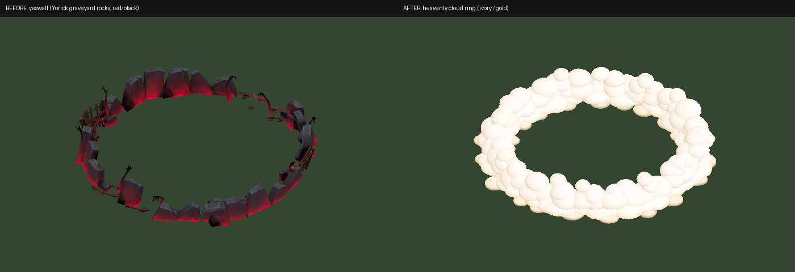

# Reaper Aurora – Angelic (v2.1.0)

Based on `Reaper-Angelic-v2_0_0.fantome` (white/gold VFX, ivory outfit, white wings).

## v2.1.0 – Ult (R) heavenly cloud ring

The R zone (`Aurora_Base_R_AoERingStatic` → `demonwall` emitter) used a ported Yorick
graveyard wall (`yeswall.skn`: tombstones, wooden fences, dead branches) with a
red/black Yorick ghoul texture, which clashed with the white/gold VFX everywhere else.

Changes (only these two WAD entries are different, same paths so no bin edits):

| Path | Change |
| --- | --- |
| `assets/f1117fc3/reaperaurora/yeswall.skn` | Replaced with a procedural ring of ~160 puffy cumulus clouds (same footprint/height, all weighted to `Root`, so the existing rise-out-of-ground `yeswall.anm` still plays) |
| `assets/f1117fc3/reaperaurora/yorickwghoul_skin50_tx_cm.skins_yorick_skin50.dds` | Replaced with a 256² DXT5 cloud shading ramp: ivory highlights (≈1.0, 0.98, 0.94 – the skin's ivory) → warm cream shadows, gold underglow at the base (≈0.70, 0.57, 0.31 – the skin's gold), alpha fading into mist at ground level |

Lighting/occlusion is baked into the UVs (particle meshes are unlit). Puffs are
ordered back-to-front for the default League camera so overlaps draw correctly.

## Rebuilding

`tools/gen_clouds.py` regenerates `heaven_wall.skn` + the ramp texture; see the
packing step in the commit history / `tools/wadlib.py`.
